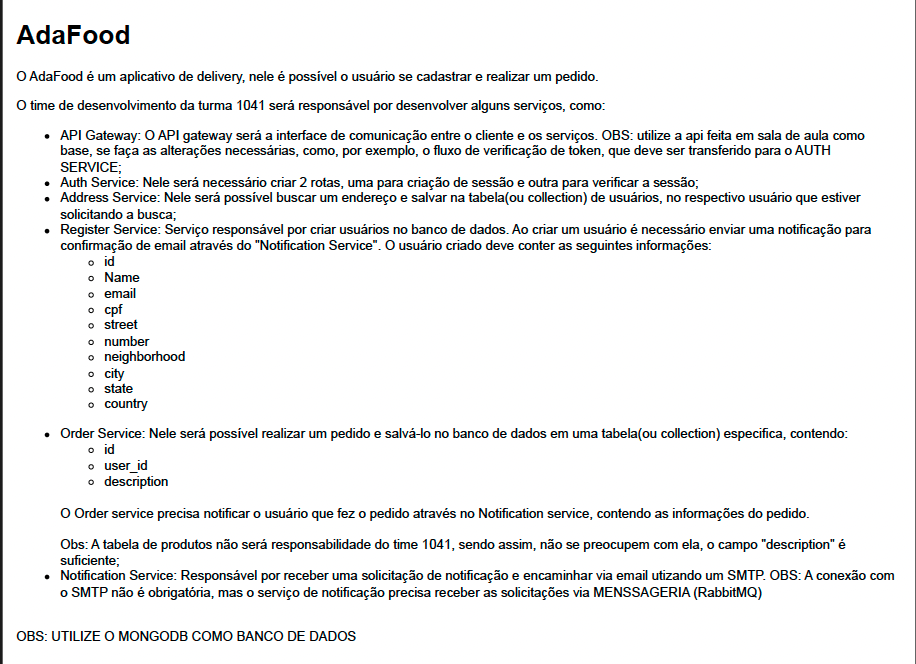

# **Projeto Microsservices ADA.**

Este arquivo explica as peculiaridades e funcionamentos do projeto.

O objetivo do projeto é criar uma microsservices de um aplicativo de delivery chamado: **AdaFood**

- Segue o que foi pedido no projeto conforme sua arquitetura:

  

  

No projeto segue 8 pastas na quais precisa ser executado o _npm run dev_ para sua funcionalidade, cada uma tem a suas portas definidas sendo:

- porta 3001: Api Gateway
- porta 3002: Addres Service
- porta 3003: DB // Não precisa subir obrigatoriamente, deixei pra caso queira fazer registro apartado ao banco.
- porta 3004: Register Service
- porta 3005: Notification Service
- porta 3006: Order Service
- porta 3007: Auth Service
- porta 3008: Validation User Service

## Instalação

Ao abrir o terminal integrado de casa pasta, realizar o comando:

```bash
npm i
```

## Dependencias:

Foram utilizadas as seguintes dependencias:

- express
- mongoose
- dotenv
- nodemon
- yup
- axios
- jsonwebtoken
- amqplib
- nodemailer

## Banco de dados

O banco utilizado é o **mongoDB**. Para realizar a conexão, fiz a conexão pela nuvem e ao realizar as etapas de conexão por nuvem, é gerado um link ao geraro o ip e ai é só copiar o drives que utiliza essa url. Segue um exemplo conforme abaixo:

`mongodb+srv://<user>:<password>@<seubanco>.u7oeiqe.mongodb.net/?retryWrites=true&w=majority`

- OBS: Caso não consiga relacionar a conexão com ip da sua maquina pelo mongoDB, defina o ip como **Allow access from anywhere**

## Notificantion com RabbitMQ

Acesse o: [Cloudamqp](https://customer.cloudamqp.com/login) e após clicar no RabbitMQ.

O CloudAMQP oferece uma plataforma fácil de usar para hospedar, configurar e gerenciar instâncias do RabbitMQ na nuvem.

Na pasta notification service é aonde está a configuração do envio das notificações por email, no arquivo .env na variavel: **EMAIL_USER** deve se passar o email que vai fazer o desparo, como sua identificação e o **EMAIL_PASS** a senha do seu email na qual você irá se identificar. Também tem a variável da url gerado pra conexão que tem que ser atribuido ao **AMQP_RABBITMQ_BASE_URL**

- Ex da url: amqps://jetqippn:<suasenha>@toad.rmq.cloudamqp.com/jetqippn

      Lembrando que caso use gmail, ele tem uma segurança na qual impede o acesso de api devido expor a senha, para a segurança aconselho gerar uma senha de acesso pelo gmail, onde da essa possibilidade pra ate mesmo não expor sua senha pessoal.

## Dicas e endpoints para rodar os processos:

Aqui nesse link irá te direcionar para um README de explicação e endpoints para executar o projeto >>> [Readme Explicação](/documents/readme-explication/endpoints.md)

## Colaborador:

- **Edrielle Duarte**
